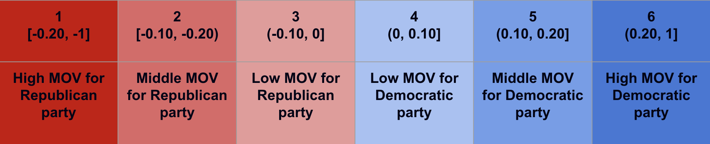
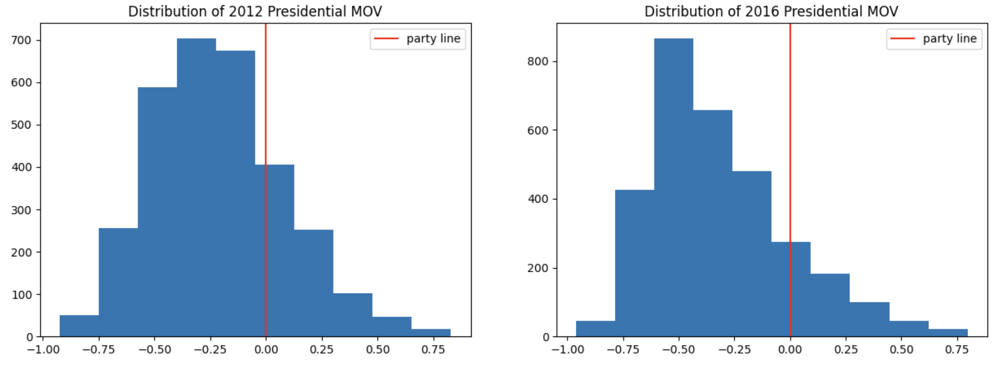
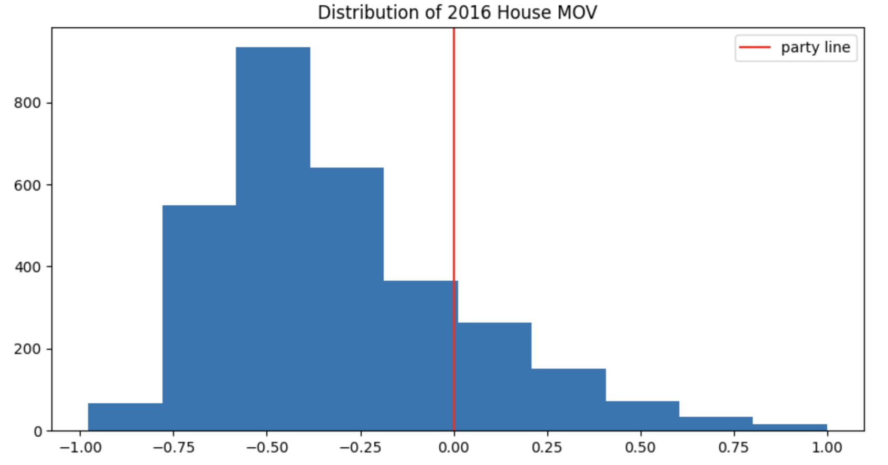
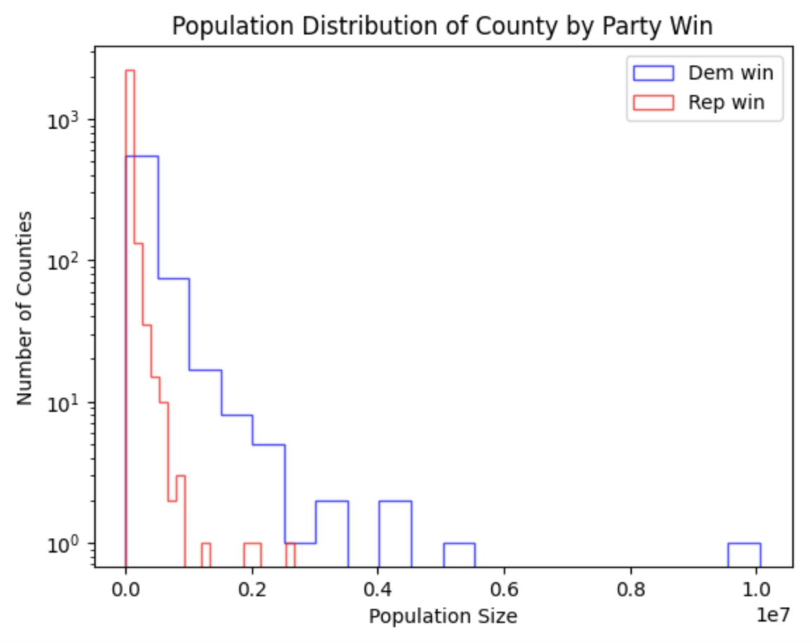
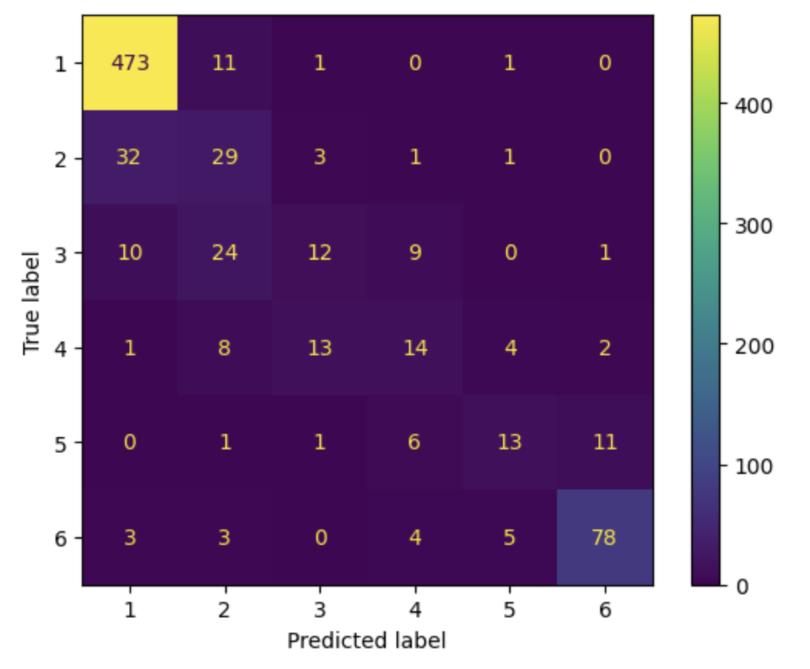
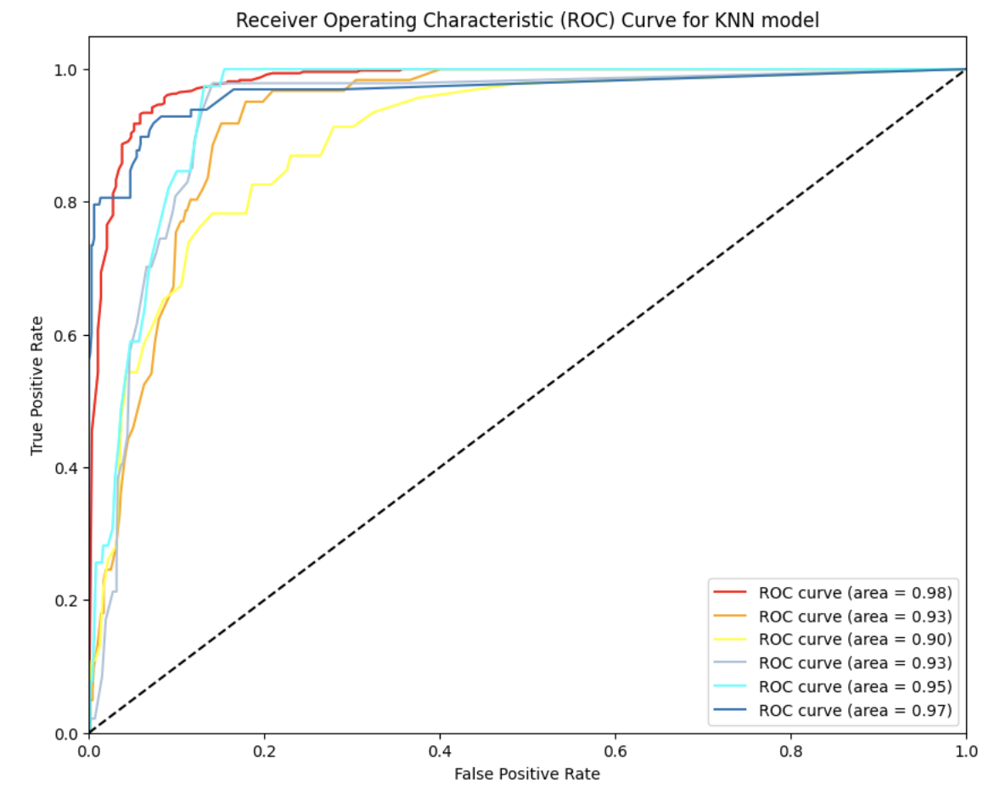

## Repository Structure 
```
├── Notebooks 
│   └── EDA.ipynb (data cleaning/EDA)
│   └── Final_Notebook.ipynb (models)
├── data
├── images
├── .gitignore
└── README.md
```
# 2018 House of Representatives Election Forecasts 

## Overview
While many people think of politics as a game of charisma and character the reality is that campaigns are run and won by strategy. That strategy can take many forms from strategic policy initiatives to lobbying the right people for donations, or in our case, figuring out how likely a candidate is to win an election. In this case, we are trying to specifically focus on the likeliness that a congressional candidate wins a given county. Now you may be asking what the importance of calculating the probability of a congressional candidate winning a county is due to the fact that it is not counties but congressional districts that define the outcome of an election. While it is true that districts are what define the outcomes of elections, there are many applications for county-level data in congressional politics. Its main use is that it can help candidates identify counties that they need to improve in by visiting more often. Or it can be used for ad targeting for an advertising firm, where you can help candidates specially target their ad spending money in areas it's needed most.

By utilizing machine learning we can attempt to go beyond the fallible process of political polling to find the patterns behind the outcomes of congressional elections. By the end of this notebook, we will present multiple models to you that can accurately predict both the winner of a congressional contest that has already happened as well as accurately able to predict the margin of victory for that race.

## Business Proposition
How well can we predict the outcome of the 2018 House of Representatives election?

## Data Sources
- 2018 MIT Election Data and Science Lab
- Dave Leip's Atlas of U.S. Elections, specifically the 2018 House of Representatives election 

## Results
Created a Margin of Victory(MOV) scale to determine how likely each political party will win a county 

MOV = the difference of the votes between the two major political parties then divided by the total votes



As you can see the distributions of the MOV of previous elections are right-skewed. 



It may seem the Republican party is performing well in these elections, however, we need to consider population size.

Here, you can see the population distribution by size of each county. 


The counties where the Democrats are winning have a larger population size than the Republicans. 
County votes do not determine the actual winner of a congressional election, the district-wide votes do, and many small counties may be outvoted by one large county.

&nbsp;
## Model
We performed multiple model types such as Logistic Regression, Decision Trees, and K-nearest neighbors(KNN) in our analysis. 

With KNN, having the highest accuracy score of ~80%.

Here is the KNN Confusion Matrix: as you can see it does perform fairly well at predicting high MOV for Republicans (class 1) and high MOV for Democrats (class 6). There is some confusion at the center for classes 3 and 4 where it's a low MOV for both parties.





This shows the ROC curves for each class in the KNN model. 

## For More Information
See the full analysis in the Jupyter Notebook or review this presentation. For additional info, contact Noah Hunsicker or Julie Leung.
