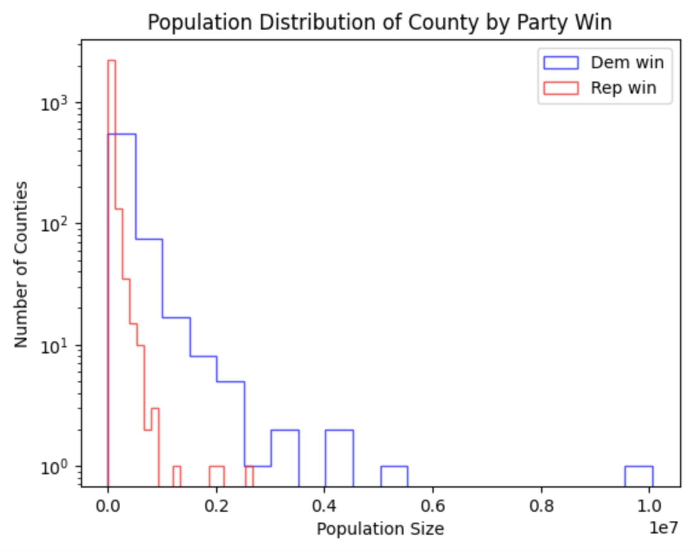

# 2018 House of Representatives Election Forecasts 

# Business Problem
How well can we predict the outcome of the 2018 House of Representatives election?

# Data Sources
- 2018 MIT Election Data and Science Lab
- Dave Leip's Atlas of U.S. Elections, specifically the 2018 House of Representative election 

# Results
Created a Margin of Victory(MOV) scale to determine how likely each political party will win a county 

MOV = the difference of the votes between the two major political parties then divided by the total votes

As you can see the distributions of the MOV are right-skewed. 

It may seem the Republican party is performing well in these elections, however, we need to consider population density.

Here, you can see the population distribution by size of each county.

We performed multiple model types such as Logistic Regression, Decision Trees, and K-nearest neighbors(KNN). 
With KNN, having the highest accuracy score of ~80%.

# For More Information
See the full analysis in the Jupyter Notebook or review this presentation. For additional info, contact Noah Hunsicker or Julie Leung.
